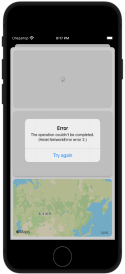

# Hotel
 
 ## Презентация

 ## Реализация
- Проект написан на **UIKit**
- Использована архитектура **MVVM**
- Использованны различные патерны проектирования
- CocoaPods **Swiftlint**
- CoreLocation
- DI
- Адаптивная верстка интерфейса **кодом NSLayoutConstraint & Anchors**. Проверна на **iPhoneSE (3st generation)**
- Работа с сетью **URLSession**
- Работа с изображениями URLSession, нативная реализация кропа изображения согласно ТЗ
- Добавлена обработка ошибок при работе с NetworkService. Ошибки отображаются пользователю через UIAlerController.

## Задание
Необходимо написать приложение, которые загружает с сервера JSON с информацией о нескольких отелях, парсит его и выводит на экран данные этих отелей. Формат отображения этих данных остается на усмотрение разработчика. Пока идет загрузка данных, пользователь должен об этом знать, соответственно, необходимо отображать activity indicator (не индикатор в статусбаре).

Должна присутствовать возможность отсортировать отели по одному из двух параметров: по расстоянию отеля от центра города или по количеству свободных номеров (данные есть в JSON-файле из API). Контрол для выбора типа сортировки остаётся на усмотрение разработчика. Первичная сортировка должна совпадать с выдачей с сервера.

Необходимо предусмотреть возможность просмотра подробной информации об отеле на отдельном экране, включая изображение. Формат отображения данных об отеле остаётся на усмотрение разработчика. Изображение отеля имеет границу по краю шириной в 1px, обязательно надо избежать отображения этой границы в интерфейсе.

Приложение должно быть собрано на последнем публичном стабильном SDK и стабильно работать на 3 последних версиях iOS (например, с сентября 2021 это iOS15, iOS14 и iOS13), должно поддерживать все размеры экранов iPhone и быть оформлено с базовыми UI контролами по Apple Design Guidelines. Язык — Swift (последняя публичная стабильная версия).

Код должен быть поддерживаем и переиспользуем.

Код-стайл должен быть таким, чтобы работа в команде над подобным проектом была комфортна.

